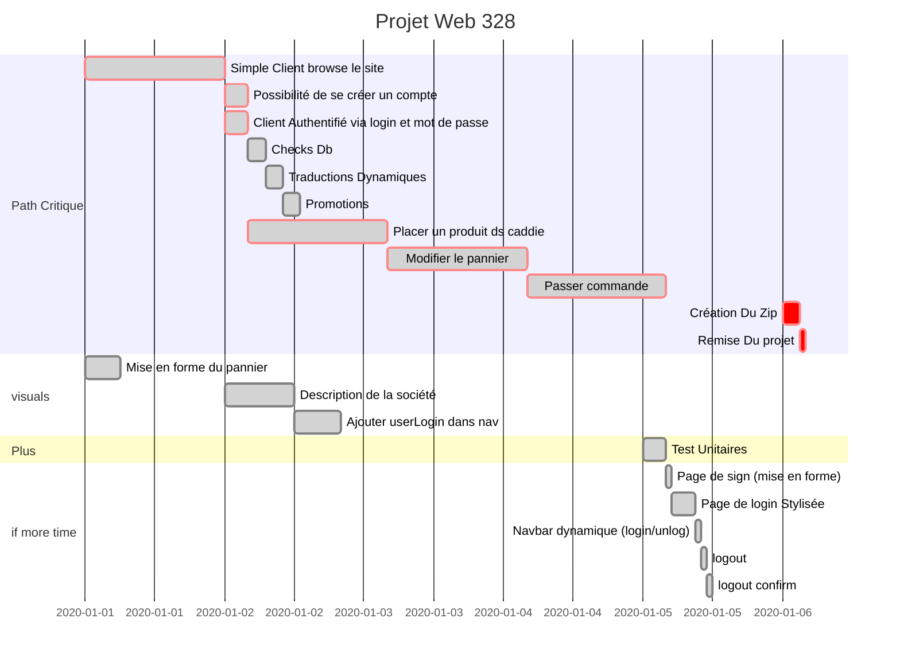
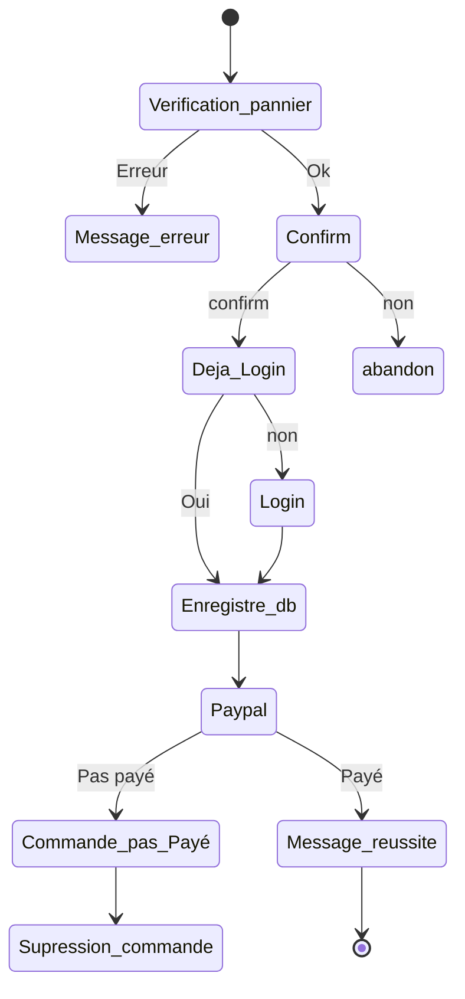

# Projet Spring  (Maj 02-01)

Vous devez déposer votre dossier sous forme d’un devoir (un fichier).

Le fichier que vous devez déposer doit respecter les contraintes suivantes :

Nom du fichier : Concaténation des prénoms-noms des deux étudiants du projet

Type de fichier : **un seul fichier .zip** (répertoire contenant plusieurs fichiers)

Contenu du fichier : 

. Les prénoms + noms des **auteurs** du projet

. Le **nom** de votre **site** de vente en ligne

. Le type de **produits** vendus par le site

. La liste des **catégories** de produits

. La description du système de **promotion**

· Le **schéma Entités-Associations** de votre base de données

. Le **script SQL** de création des tables

. Le **code source** de votre projet **:** celui-ci doit comprendre le fichier pom.xml et le répertoire src (code java, pages JSP, template, css, ressources pour internationalisation, application.yml, tests unitaires…). N.B. Afin de diminuer la taille du code source, vous pouvez supprimer le répertoire contenant les images.

Date de dépôt du travail : au plus tard le **lundi 6 janvier 2020 à 08h** du matin

## Consignes 

1. Le programme consiste en une application Web à développer dans l’environnement IntelliJ en utilisant les frameworks Spring, Maven, Hibernate, JUnit et Mockito. Bootstrap peut également être utilisé pour générer les CSS. 
2. L’application doit être déployée sur un serveur Tomcat. 
3. L’application doit accéder à une base de données relationnelles, par exemple MySQL. Les contraintes d’intégrité référentielle doivent être vérifiées (clés étrangères). Prévoyez dans le script de création des tables des contraintes assurant l’intégrité de la base de données (clé primaire, clé étrangère, check…). Il vous sera demandé de prévoir les checks dans le script de création des tables, et ce, même si MySQL ne vérifie pas les checks ! 
4. Vous devez rendre le dossier contenant le résultat de votre travail au plus tard le deuxième jour de la session de janvier.

## Vérification des données user

* ~~les champs obligatoires doivent être remplis ;~~
* les champs de type numérique ne contiennent que des chiffres ; 
* saisie de mot de passe : prévoir deux champs de saisie de mot de passe ; les deux valeurs introduites doivent être égales ; 
* l’adresse email doit avoir un format correct (ex : contenir @ et . ) ; 
* certains champs doivent avoir une longueur minimale et maximale (téléphone, code postal…) ; 
* la quantité commandée doit être positive ; 

## Todo-list

### Placer un produit dans le caddie

* ~~ajouter nb X d'éléments à ajouter au panier dans la page d'un produit~~
* ~~Ajout d'éléments au caddie~~
* ~~modification du caddie~~
  * ~~top navigation bar~~
  * ~~total~~
  * ~~mise à jour dynamique~~

### Modifier le panier

* ~~+~~
* ~~-~~
* ~~supprimer du panier~~

### Passage de commande 

* ~~vérifier que l'utilisateur est bien authentifié~~
* ~~Vérifier la commande (non nulle, ...)~~
* ~~Sauvegarder la commande dans la base de donnée~~
* ~~Confirmer la commande à l'utilisateur ( êtes vous sur)~~
* ~~Payement avec Paypal~~
* ~~Confirmation de Commande~~ 

### ~~Description de la société~~

* ~~contact~~
* ~~nom~~
* ~~participants~~
* ~~Présentation~~

### ~~Traduction~~

* ~~Messages dynamiques (articles)~~
* ~~Messages d'erreur~~
* ~~Libellés statiques~~
* ~~Boutons~~

### ~~Promotions~~

* ~~sur tout en fonction des dates~~
* ~~Appliquer à la commande~~

### ~~Page d'accueil~~

* ~~Message unique (vous êtes)~~

### ~~Junit et Mockito~~

### ~~Verification des données entrées par l'utilisateur~~

### ~~check en DB~~

